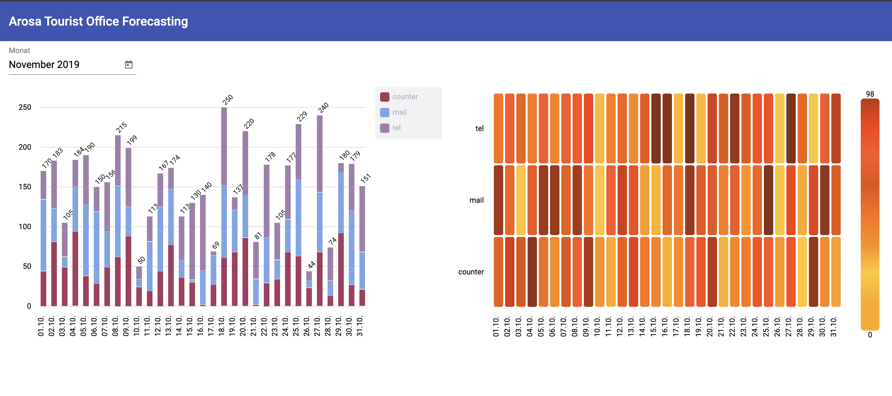

# Arosa Tourist Office Forecasting

## Case

[See here](http://hack.opendata.ch/project/375)

## Models

TODO

## API

The API based on python flask provides a HTTP GET endpoint to fetch predicted values for a specified month serialized as JSON.

## Webapp

The webapp consists of a small angular app that plots the predicted values of an entire month.

